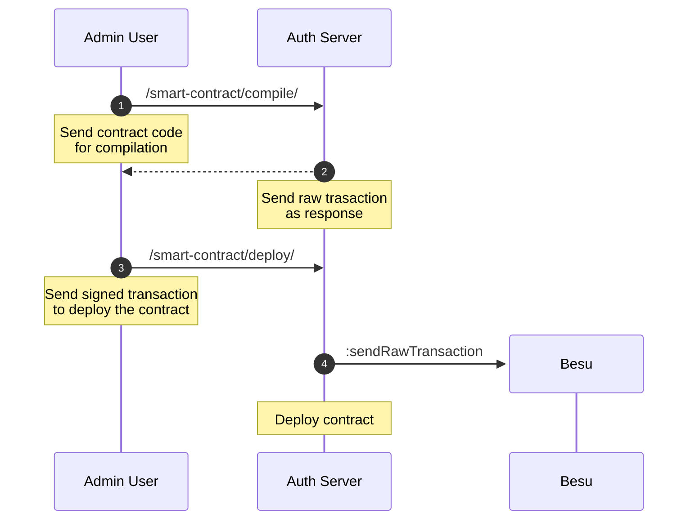

# Smart Contract Deploy

```mermaid

sequenceDiagram
	autonumber
	participant AU as Admin User
	participant AS as Auth Server
	
	
	AU->>AS: /smart-contract/compile/
	Note over AU: Send contract code<br> for compilation
	AS-->>AU:  
	Note over AS: Send raw trasaction<br> as response
	AU->>AS: /smart-contract/deploy/
	Note over AU: Send signed transaction<br> to deploy the contract
	
	create participant B as Besu
	AS->>B: :sendRawTransaction
	Note over AS: Deploy contract

```

